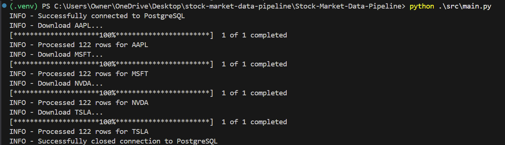
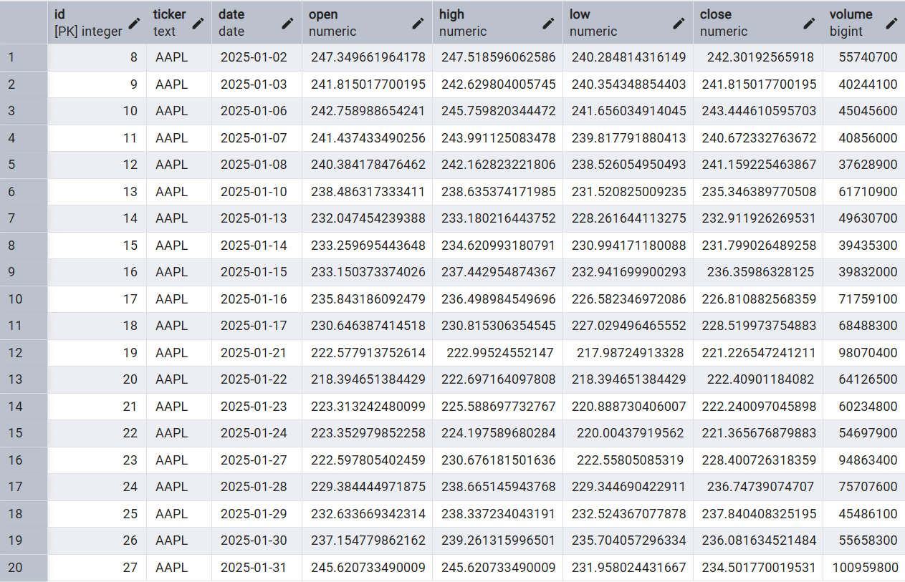

# Stock Market ETL Pipeline

Stock Market ETL Pipeline is a Python application that downloads historical stock market data from Yahoo Finance and stores it in a PostgreSQL database for analysis. Using the yfinance library, the pipeline retrieves daily price and volume data for a customizable list of stock tickers, then inserts the records efficiently using psycopg. The project follows software engineering best practices by using environment-based configuration, structured logging, robust exception handling, and duplicate prevention through PostgreSQL conflict resolution.

## Features

- Downloads historical stock market data from Yahoo Finance using `yfinance`
- Supports downloading data for multiple stock tickers in a single run
- Stores daily OHLCV (Open, High, Low, Close, Volume) data in PostgreSQL
- Prevents duplicate records using a unique database constraint and `ON CONFLICT DO NOTHING`
- Uses environment variables (`.env`) to securely manage database credentials
- Modular project structure with separate database and data download modules
- Structured logging using Python's built-in `logging` module
- Robust exception handling with automatic database connection cleanup

## Technologies Used

- **Python 3**
- **PostgreSQL**
- **psycopg** – PostgreSQL database adapter
- **yfinance** – Historical stock market data
- **python-dotenv** – Environment variable management
- **logging** – Application logging
- **Git & GitHub** – Version control

## Project Structure

```text
Stock-Market-Data-Pipeline/
│
├── src/
│   ├── main.py              # Main ETL pipeline
│   ├── download_data.py     # Downloads stock data from Yahoo Finance
│   └── database.py          # PostgreSQL connection functions
│
├── .env                     # Database credentials (not committed)
├── .gitignore
├── requirements.txt
└── README.md
```

## Database Schema

The project stores stock market data in a PostgreSQL table named `prices`.

```sql
CREATE TABLE prices (
    ticker TEXT NOT NULL,
    date DATE NOT NULL,
    open DOUBLE PRECISION,
    high DOUBLE PRECISION,
    low DOUBLE PRECISION,
    close DOUBLE PRECISION,
    volume BIGINT,
    CONSTRAINT unique_ticker_date UNIQUE (ticker, date)
);
```

## Installation & Configuration

### 1. Clone the Repository
```bash
git clone <repository-url>
cd Stock-Market-Data-Pipeline
```

### 2. Configure Virtual Environment & Dependencies
```bash
# Create environment
python -m venv .venv

# Activate environment (Windows)
.venv\Scripts\activate

# Activate environment (macOS/Linux)
source .venv/bin/activate

# Install dependencies
pip install -r requirements.txt
```

### 3. Initialize the Database
1. Open your PostgreSQL terminal or GUI client (e.g., pgAdmin).
2. Create a target database: `CREATE DATABASE market_data;`.
3. Execute the SQL script provided in the [Database Schema](#-database-schema) section to build the table structure.

### 4. Setup Environment Secrets
Create a `.env` file in the root directory of the project and populate it with your local credentials:

```ini
DB_HOST=localhost
DB_PORT=5432
DB_NAME=market_data
DB_USER=postgres
DB_PASSWORD=your_secure_password
```

---

## 🏁 Execution & Verifying Output

### 1. Configure Tickers
To customize the pipeline targets, modify the target array directly within `src/main.py`:

```python
ticker_list = ["AAPL", "MSFT", "NVDA", "TSLA"]
```

### 2. Run the Pipeline
```bash
python src/main.py
```

### 3. Expected Runtime Logs
```text
2026-07-15 20:14:52 - INFO - Successfully connected to PostgreSQL
2026-07-15 20:14:52 - INFO - Downloading AAPL...
2026-07-15 20:14:53 - INFO - Processed 122 rows for AAPL
2026-07-15 20:14:53 - INFO - Downloading MSFT...
2026-07-15 20:14:54 - INFO - Successfully closed connection to PostgreSQL
```

### 4. Verify Database Ingestion
Run the following verification query inside your PostgreSQL client to confirm successful loading:

```sql
SELECT ticker, COUNT(*), MIN(date), MAX(date) 
FROM prices 
GROUP BY ticker;
```
---

## Skills Demonstrated

- Python programming
- PostgreSQL database design
- SQL and parameterized queries
- ETL pipeline development
- Environment variable management
- Structured logging
- Exception handling
- Git & GitHub
- Modular software architecture

## Future Improvements

- Automate daily execution using Windows Task Scheduler or cron
- Store logs in a dedicated log file
- Add Docker support for simplified deployment
- Build a dashboard to visualize historical stock data
- Support incremental daily updates instead of fixed date ranges
- Add unit tests for database and download modules
- Support additional financial data providers

## Screenshots

### Terminal Output



### PostgreSQL Database

